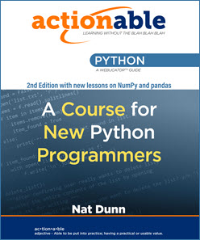

# Actionable Python Class Files

This repository contains the class files used in our [Actionable Python book](https://www.amazon.com/Actionable-Python-Course-New-Python-Programmers/dp/1951959050).

## Book Description

## What You Will Learn
 * To set up your environment for Python development.
 * To write your own Python modules and functions.
 * To use Python to do math.
 * To index, slice, search, and format text.
 * To work with lists and dictionaries and other Python iterables.
 * To create virtual environments to contain your Python projects.
 * To write conditional and flow-control logic.
 * To gracefully handle errors in your programs.
 * To work with dates and times in Python.
 * To open files from the filesystem and to create, edit, delete, and move files.
 * To style your Python code according to industry standards.
 * To work with regular expressions for pattern matching.
 * To work with data from CSV files, web pages, XML, JSON, and databases.
 * To test and debug your code.
 * To write object-oriented Python.
 * To do data analysis and create beautiful charts using JupyterLab, NumPy, pandas, and matplotlib.

## Table of Contents

## About Webucator
[Webucator](https://www.webucator.com) provides technical and business training. We have provided training to over 70% of the Fortune 100 companies (See [Partial Client List](https://www.webucator.com/about-us/client-list.cfm)).
### PRIVATE CLASSES
Our private classes can be delivered at your offices, in a nearby hotel or rented training room, or in a live virtual environment.
### PUBLIC CLASSES
Our public classes are delivered in a live virtual environment by an expert instructor.
### SELF-PACED COURSES
We also offer self-paced courses that are available on-demand 24/7.

## About Nat Dunn
Nat Dunn founded [Webucator](https://www.webucator.com) in 2003 to combine his passion for technical training with his business expertise, and to help companies benefit from both. After spending the first several years developing and delivering classes throughout the United States, Nat expanded Webucator's team of trainers to teach topics outside of his own expertise. Webucator now offers classes on Microsoft technologies such as Office, ASP.NET, and SharePoint; Web technologies such as HTML, CSS, JavaScript, React, Vue.js, Angular, and PHP; Adobe software such as Photoshop, InDesign, and Illustrator; programming languages, such as Java, Python, and R; database technologies, such as SQL Server, Oracle, and MySQL; and much more.

Nat has a BA from Pomona College and an MBA from Harvard Business School.